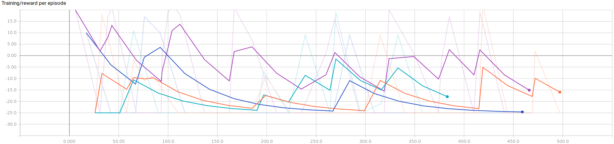
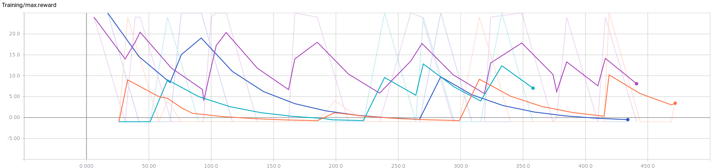

## Video
<iframe src="https://player.vimeo.com/video/221383197" width="640" height="360" frameborder="0" webkitallowfullscreen mozallowfullscreen allowfullscreen></iframe>

## Project Summary
 

Figure 1: Symbolic view of the game.

 
The goal of our project is to design and implement a learning algorithm that trains an agent to collaborate with another (human or AI) agent to catch a pig in Minecraft according to the rules of [The Malmo Collaborative AI Challenge](https://www.microsoft.com/en-us/research/academic-program/collaborative-ai-challenge/# "Challenge Homepage"). 

There are several aspects of this problem that make it difficult to solve without using AI&mdash;and difficult to solve using AI! First of all, it is well-suited to being represented as a Markov Decision Process (MDP), which we know we can find an optimal policy for. However, the state space is very complex, so finding an optimal solution isn't actually feasible. 

Why is the state space so complex? There are several reasons. 
* The agents must work together to catch the pig, because it can only be caught when its path is blocked on all four sides: by the two agents and two fence blocks. This means our agent has to somehow take into account the decisions of the other agent.
* Only 23 of the squares on the 81-square board are viable positions for an agent to occupy in the game, but which way the agent is turned matters. And taking into account which way an agent is turned makes 23 into $$4^{23}$$!

## Approaches

### Baseline Agents

We work from two baseline agents, both provided by the organizers of the competition. The first baseline agent uses A\* to determine the shortest distance to aid in capturing the pig. The second is random.

### Our Approaches

At first, we used a deep reinforcement learning approach, which is described in detail in our [status report](https://hfloresr.github.io/Sandhog/status.html). However, this approach was not well-suited to the problem because in the pig chase game, the immediate rewards drop off quickly and significantly. Our improved approach, the Sandhog\* agent, described below, uses A\*. It improves on Microsoft's A\* algorithm by taking into account the probability that the second agent will collaborate with our agent. This approach allows for more collaboration with the other agent.

#### Sandhog\*

The Sandhog\* agent interacts with the Minecraft world through acting, observing, and receiving rewards.

#### Actions

At each time step, the agent selects an action $$a_t$$ from the action space, $$\mathcal{A} = \{turn left, turn right, step forward\}$$. 

#### Observations

The position of all actors (agent1, agent2, and the pig) are defined by (1) a pair of integers representing the actor's position on the game board, a $$9 \times 9$$ grid:

$$x_{agent1_{t}}, \, x_{agent2_{t}}, \, x_{pig_{t}} \in \mathcal{X}^{2}, \; \text{where} \; \mathcal{X} = \{0, 1, 2, 3, 4, 5, 6\}$$

and (2) the actor's orientation (i.e. which way it is facing):

$$o_{agent1_{t}}, \, o_{agent2_{t}}, \, o_{pig_{t}} \in \mathcal{O}, \; \text{where} \; \mathcal{O} = \{North, East, South, West\}$$

Our agent observes the positions and orientations of the pig and second agent relative to its own position. 

#### Rewards

The agent also receives a reward $$r_t$$ representing the change in game score. Although the game score depends on the previous sequence of actions and observations, immediate rewards are described as:
  * +5 for exiting through a gate
  * +25 for catching the pig
  * -1 for each action

A symbolic representation of the state space is shown in figure 1.

#### Formal Definition of the State Space

We further extend our state space to include the second agent's previous move, in order to be able to infer whether it intends to collaborate with our agent. 

Therefore, we formalize the definition of our state space as a finite Markov Decision Process (MDP) where the sequence $$s_t$$ is a distinct state at each time $$t$$: 

$$s_t = \{x_{agent1_{t}}, \, x_{agent2_{t}}, \, x_{pig_{t}}, \, o_{agent1_{t}}, \, o_{agent2_{t}}, \, o_{pig_{t}}, a_{agent2_{t-1}}\}$$

We cannot be certain that the actions of *agent2* and the pig *directly* map to any sort of "intention." Thus, we developed a *probabilistic* model to relate action to intention. However, this model only infers the objective of *agent2*, because (1) our primary objective is to collaborate with *agent2* to acheive the highest reward possible and (2) we assume that all of the pig's actions are random. 

To create a collaborative effort between our agent (*agent1*) and *agent2*, we based our agent's decisions on the probability that *agent2* intends to help catch the pig.  To describe the intentions of *agent2*, we define the random variable $$Z = \{Random, Exit, Pig\}$$. We then represent our probability vector, $$\mathbf{p}$$, as our distribution over the random variable $$Z$$,

$$\mathbf{p}_{t} =
\begin{bmatrix} 
\mathbb{P}[Z = Random] \\
\mathbb{P}[Z = Exit] \\
\mathbb{P}[Z = Pig]
\end{bmatrix}$$

We assume that *agent2* is an optimal agent, such that it trys to find the shortest path to their goal. At each time step $$t$$, we compute the shortest path to the pig and the two exits via A* search algorithm. We can then estimate *agent2*'s optimal policy for each of the possible intentions, which is represented as

$$\pi(s_{t}) = \{\pi_{exit_{t}}, \, \pi_{pig_{t}}\}$$

We store that last two steps so we can infer *agent2*'s intent by as the conditional probability of $$\pi$$ given the previous states. We included a discount factor, $$\gamma$$, to give more weight to more recent decisions, the probability is as follows,

$$\mathbb{P}[Z \, \lvert \, p]
= \prod_{i=0}^{n-1} \gamma^i \mathbb{P}[p \, \lvert \, s_{t-(n-i)}], \; \forall p \in \pi$$

Furthermore, we assume that the *agent2* is a random agent if all of the probabilities are equal. Since we are assuming that *agent2* acheives its goals via shortest path, then we can extract *agent2*'s intent by maximizing over the conditional probabilities:

$$Z' = arg\,max_{x \in \pi} \mathbb{P}[Z \, \lvert \, x]$$

Once we have determined *agent2*'s intent, we can update our probabilities by adding a constant weight, $$\eta$$, to the respecitve intent and normalizing by $$\alpha$$, as such

$$\mathbf{p}_{t+1} =
\begin{cases}

\alpha \cdot
\begin{bmatrix} 
\mathbb{P}[Z = Random] + \eta\\
\mathbb{P}[Z = Exit] \\
\mathbb{P}[Z = Pig]
\end{bmatrix}, & \text{if $Z' = Random$}\\

\alpha \cdot
\begin{bmatrix} 
\mathbb{P}[Z = Random]\\
\mathbb{P}[Z = Exit] + \eta\\
\mathbb{P}[Z = Pig]
\end{bmatrix}, & \text{if $Z' = Exit$}\\

\alpha \cdot
\begin{bmatrix} 
\mathbb{P}[Z = Random] \\
\mathbb{P}[Z = Exit] \\
\mathbb{P}[Z = Pig] + \eta
\end{bmatrix}, & \text{if $Z' = Pig$}\\
\end{cases}$$

Where our normalization factor, $$\alpha$$, is the added weight, $$\eta$$, plus the total probability:

$$\alpha = \eta +  $$\sum_{x \in Z} \mathbb{P}[x]$$ 

To determine a strategy for our agent, we used an $$\epsilon - greedy$$ approach by determining the intentions of *agent2*. At a given time step, $$t$$, we have a probability vector, $$\mathbf{p}_{t}$$ (as defined earlier), that helps estimate the cooperation level of *agent2*. With probability $$1 - \epsilon$$ we determine that *agent2's* intensions is $$Z' = arg\,max_{x \in \pi} \mathbb{P}[Z \, \lvert \, x]$$. Otherwise, we choose the second highest probabilty in $$\mathbf{p}_{t}$$. After deciding the intentions of *agent2*, our agent follows a simple strategy that can be described as the following:

    * If agent determines that agent2 is a cooperative agent:
        * If the pig has more than two adjacent positions:
            * Go to nearest exit if our agent is closer to it than agent2 to any of the other exits
            * Otherwise, chase the pig
        * Else:
            * Chase the pig
    * Else:
        * Go to nearest exit if our agent is closer to it than agent2 to any of the other exits
        * Otherwise, chase the pig

Since we compute the shortest path for all goals and for both agents at each time step, our agent can effeciently make the necessary action based on this approach.

## Evaluation

To determine how well our agent might perform in the Microssoft challenge, we compared our agents with a random agent and an A\* agent. The random agent and A\* agent used in our experiments were implemented by Microsoft and were used as our baseline. The agents that we implemented were the Deep-Q Agent and the Sandhog\* Agent, which are described in detail in our status page and final page respectively. 

To compare between all of the agents, we collected three metrics to measure performance over training time: rewards per episode, actions per episode, and maximum rewards. All the figures show our metrics per episode. To avoid a lengthy training time, only 450 actions were considered.

Figure 2: Rewards per episode. The colors to agent mapping are: (purple, blue, orange, teal) = (Sandhog* Agent, A* Agent, Deep-Q Agent, Random Agent) 

 
On average, our Sandhog\* Agent performed reasonably well in comparison to all other agents. The ability to make decisions on the probability of whether the other agent is cooperative is an upgraded heuristic to the vanilla A\* Agent. Furthermore, we believe that in pig challenge situation, the Deep-Q Agent is at a disadvantage. Since rewards are cumulative between the two agents, negative rewards can accumulate significantly and rapidly due to the penalization of turns and steps. This makes it difficult for our Deep-Q agent to learn in a short period of time along with significant drops in rewards for any exploration.

 

Figure 3: Number of actions agent makes per episode. The colors to agent mapping are: (purple, blue, orange, teal) = (Sandhog* Agent, A* Agent, Deep-Q Agent, Random Agent)

 
Evidence of the correlation between exploration and rewards are apparent in figure 3. We can see that our Sandhog* agent produces the least amount of actions, with respect to all the other agents. This is mostly due to our agent's ability to take the time to determine the cooperation level of the other agent. By having some confidence of the cooperation level of the other agent, our agent can determine the best goal and make the minimal steps possible by employing the A* algorithm for the shortest path to the goal at timestep $$t$$.

 

Figure 4: Max rewards. The colors to agent mapping are: (purple, blue, orange, teal) = (Sandhog* Agent, A* Agent, Deep-Q Agent, Random Agent)

 
As expected, our Sandhog\* Agent consistently produces the maximum rewards. Also, the Deep-Q Agent slowly starts to increase in maximum rewards, if given enough time. However, the challenge does not provide enough time for our Deep-Q Agent to perform well. 

 

$$\begin{array}{|c||c|c|}
\hline
\textbf{Agent} & \textbf{Avg (100k)} & \textbf{Var (100k)} \\
\hline
\text{Sandhog*} &  0.940711 & 33.401065  \\
\hline
\text{Deep-Q} & -0.893913 & 2.338310  \\
\hline
\text{A*} & -0.590263 & 10.181000 \\
\hline
\text{Random} & -0.768211 & 5.343625\\
\hline
\end{array}$$

Figure 5: Average rewards and variance over 100 episodes.

 
For the final evaluation, we used Microsoft's evaluation script which outputs a json file displaying the average rewards and the variance over 100 episodes. The script also evaluates the agents at 500K, however we omitted the 500K results since our baseline, Microsoft's A\* agent, crashes over 100K on our machines. Our Sandhog\* Agent outperforms our baseline agents along with our initially proposed agent, Deep-Q Agent. The overall variability is quite high, however from our training results, there is some indication that this variance decreases over time. 

Some future improvements can be made to try to improve the variance of our agent. Furthermore, we can consider trying to learn an intitial strategy from the computed probabilities during each episode. Although there has been many advancements in the field of reinforcement learning, we have shown that a classical A.I. approach can be a strong competitor. The main drawbacks to our initial approach with deep reinforcement learning are that it did not model the dynamics of the challenge well and did not involve the other agents, along with their rewards, in our environment. Our initial formalization of our MDP only took into account the actions and rewards of our Deep-Q agent. This lead to a very noisy situation where the goals of the two agents were not well aligned.

In conclusion, we present a possible approach to the collaborative problem presented by the Microsoft malmo challenge. We modelled the uncertainty of the second agent for a more collaborative approach in a dynamic multiagent environment. Finally, we have shown that our final approach is strong and competitive enough for the competition. 

## References

Sutton, Richard S. and Andrew G. Barto. 1998. *Reinforcement Learning: An Introduction.* The MIT Press, Cambridge, MA.

Szepesvari, Csaba. 2010. *Algorithms for Reinforcement Learning*. Morgan & Claypool.

Mnih, Volodymyr; Kavukcuoglu, Koray; Silver, David; Graves, Alex; Antonoglou, Ioannis; Wirstra, Daan; Riedmiller, Martin. *Playing Atari with Deep Reinforcement Learning*, December 2013.

Johnson M., K., Hutton T., Bignell D. (2016) The Malmo Platform for Artificial Intelligence Experimentation. Proc. 25th International Joint Converence on Artificial Intelligence, ed. Kambhampati S., p. 4246. AAAI Press, Palo Alto, California USA. https://github.com/Microsoft/malmo.

