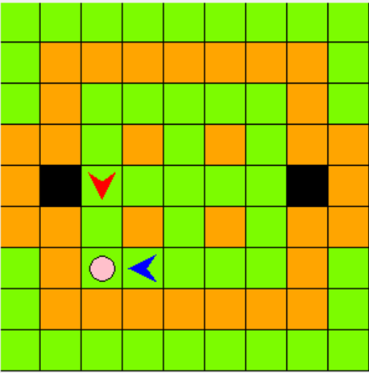
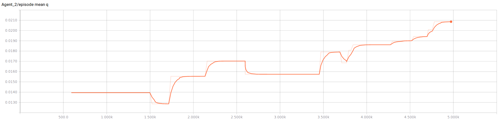
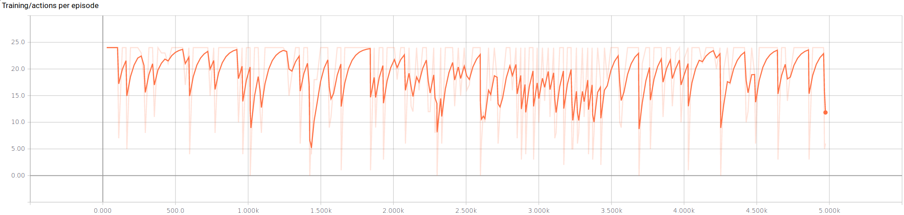

<iframe src="https://player.vimeo.com/video/219234708" width="640" height="500" frameborder="0" webkitallowfullscreen mozallowfullscreen allowfullscreen></iframe>

<a href="https://vimeo.com/219234708">Deep Q Pig Chase</a> from <a href="https://vimeo.com/user67099619">Hector Flores</a> on <a href="https://vimeo.com">Vimeo</a>.

## Project Summary

The focus of our project is to design and implement a learning algorithm that trains an agent to collaborate with another (human or non-human) agent to catch a pig in Minecraft according to the rules of [The Malmo Collaborative AI Challenge](https://www.microsoft.com/en-us/research/academic-program/collaborative-ai-challenge/# "Challenge Homepage").

We have defined our baseline agent to be one that uses A* to determine the shortest distance to aid in capturing the pig. We aim to improve our baseline by using reinfocement learning and train an agent to maximize aggregate future rewards.

Given the complexity of the collaborative challenge, we will employ off-the-shelf deep learning and reinforcement learning libraries to provide the necessary flexibility to explore various reinforcement design paradigms along with parameter tuning.

## Approach

 

Figure 1: Symbolic view of our state space.

 
We consider the task in which our agent interacts with the Minecraft environment by making sequence of actions, observations, and receiving rewards. At each time step, the agent selects an action $$a_t$$ from the action space, $$\mathcal{A} = \{turn left, turn right, step forward\}$$. The agent observes an image $$x_t \in \mathbb{R}^{d}$$ from the emulator, which is a vector of pixel values representing the current screen frame. The agent also receives a reward $$r_t$$ representing the change in game score. Although the game score depends on the previous sequence of actions and observations, immediate rewards are described as:
  * +5 for exiting through a gate
  * +25 for catching the pig
  * -1 for each action

A symbolic representation of the state space is shown in figure 1.

Since the agent only observes the current screen, it is impossible for the agent to fully perceive the current situation fom the the current screen $$x_t$$. Therefore, we consider the sequences of actions and observations, $$s_t = x_{1},a_{1},x_{2}, ... , a_{t-1}, x_{t}$$, where $$x_t$$ is the vector of pixel values that represent the visual input from the agent. The sequences are large but finite, therefore formalizing our finite Markov Decision Process (MDP) where the sequence $$s_t$$ is a distinct state at each time $$t$$.

The goal of our agent is to select actions in order to maximize future rewards. With the discount factor of $$\gamma \; (=0.99)$$, our future reward at time $$t$$ is defined as:

$$R_{t} = \sum_{t'=t}^{T} \gamma^{t'-t}r_{t'} \text{,}$$

where $$T$$ is the number of time steps in an episode of the pig chase game. We use the standard definition of the optimal action-value function in which the maximum expected reward acheivable by following any policy $$\pi$$, after seeing some sequence $$s$$ and taking some action $$a$$ is,

$$Q^{*}(s,a) = \max_{\pi} \mathbb{E} [ R_{t} \, \lvert \, s_{t}=s, a_{t}=a, \pi ]$$

The optimal policy can be obtained by solving the Bellman equation iteratively, however we would have to maintain estimates of the action-value function for all states in a $$Q$$-table. Since our state are a vector of screen pixels that are rescaled to an image of size $$84\times84$$ with $$4$$ consecutive images and $$256$$ gray levels, our $$Q$$-table would be $$256^{4\times84\times84}$$.

To avoid an extremely large Q-table, we used a function approximator to approximate the $$Q$$ function:

$$Q(s, a; \theta) \approx Q^{*}(s, a)$$

In this project we used a convolution neural network as a nonlinear function approximator to estimate the action-value $$Q$$ function, where $$\theta$$ is our neural network weights.. The architecture for our neural network is as follows:

 

$$\begin{array}{|c|c|c|c|c|c|c|}
\hline
\textbf{Layer} & \textbf{Input} & \textbf{Filter size} & \textbf{Stride} & \textbf{Number of filters} & \textbf{Activation} & \textbf{Output} \\
\hline
\text{Convolution 1} & 84\times84\times84 & 8\times8 & 4 & 32 & \text{ReLU} & 20\times20\times32 \\
\hline
\text{Convolution 2} & 20\times20\times32 & 4\times4 & 2 & 64 & \text{ReLU} & 9\times9\times64 \\
\hline
\text{Convolution 3} & 9\times9\times64 & 3\times3 & 1 & 64 & \text{ReLU} & 7\times7\times64 \\
\hline
\text{Dense} & 512 & & & & & \\
\hline
\end{array}$$

 
The $$Q$$-learning update uses the Huber loss function, defined as:

$$L(x) =
\begin{cases}
\frac{1}{2}{x}^2, & \text{if $|x| \lt \delta$} \\
\delta |x| - \frac{1}{2}\delta^{2}, & \text{if $|x| \geq \delta$}
\end{cases}$$

where $$\delta \; (= 1)$$ is the outlier threshold parameter. We used stochasitc gradient descent
to optimize the Huber loss function.

 
Since reinforcement learning with a neural network is known to be unstable we used experience replay
that randomly samples the data to remove correlations in the observation sequence. Our temporal memory
stores $$N$$ previouse samples of the agent's experiences $$(t, t-1, t-2, .. , t-N)$$. During training,
we use a linear $$\epsilon-greedy$$ approach to offset the exploration/exploitation dilemma. The linear
$$\epsilon-greedy$$ approach linearly interpolates between $$\epsilon_{max} \; (=1)$$ to $$\epsilon_{min} \; (=0.1)$$ to linearly anneal $$\epsilon$$ as a function of the current episode.

Since we are working with raw pixel values for Minecraft, we introduce teh function $$\phi$$ which takes $$m = 4$$ most recent frames and scales the RGB frame into an $$84\times84$$ grayscale frame

The learning algorithm can be described as the following:
  * Initialize temporal memory $$D$$ to capacity $$N$$
  * Initialize action-value function $$Q$$ with random weights $$\theta$$
  * Initialize target action-value function $$\hat{Q}$$ with weights $$\theta^{-} = \theta$$
  * **For** episode $$= 1, ... , M$$:
      * Initialize sequence $$s_1 = {x_1}$$ and preprocessed sequence $$\phi_1 = \phi(s_1)$$
      * **For** $$t = 1, ..., T$$:
          * Select random action $$a_t$$ with probability $$\epsilon$$
          * Execute action $$a_t$$ and observe reward $$r_t$$ and frame $$x_{t+1}$$
          * Set $$s_{t+1} = s_{t},a_{t},x_{t+1}$$ and preprocess $$\phi_{t+1} = \phi(s_{t+1})$$
          * $$D$$.append($$\phi_{t}, a_{t}, \phi_{t+1}$$)
          * Sample random minibatch from $$D$$
          * Set $$y_{j} =
                \begin{cases}
                r_{j}, & \text{if episode terminates at step $j+1$} \\
                r_{j} + \gamma \max_{a'} \hat{Q}(\phi_{j+1}, a'; \theta^{-}), & \text{otherwise}
                \end{cases}$$
          * Perform stocahstic gradient descent step on $$L(y_j - Q(\phi_{j},a{j};\theta))$$, where
            $$L$$ is the Huber loss function as previously described.
          * Every $$C$$ steps reset $$\hat{Q} = Q$$

## Evaluation

We chose five metrics to measure our agent performance over training time: mean $$Q$$ value,  actions per episode, maximum reward, minimum reward, and rewards per episode.

Figure 2 shows how our agent starts by choosing actions with low $$Q$$-values, and quickly begins to choose actions with a higher $$Q$$-value.

Figure 2: Average chosen $$Q$$ value

 
From figure 3, the number of actions per episode our agent makes is noisy at best. The variability seems to decrease after 2000 episodes, and with perhaps a longer training time it might stabalize to a smaller range of actions.

Figure 3: Number of actions agent makes per episode.

 
The maximum rewards during training is noisy, but averages around 6.

Figure 4: Max rewards.

 
The minimum rewards during training has a periodicty where it's peaks are grouped closely together.

Figure 5: Min rewards per episode.

 
The total rewards per episode seem to average around zero. Our agent seems to break even in the pig chase challenge.

Figure 6: Rewards per episode.

## Remaining Goals and Challenges

Over the next few weeks, our goals are to:

1. Make the agent more collaborative by embedding the other agent's actions into the states of our MDP.

The challenges posed by these are:

1. The increased complexity of a more collaborative approach.

## Video Summary

